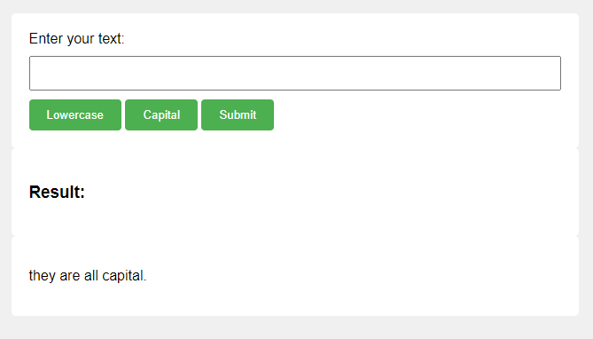

# Building a Simple Web Application with Flask

## Objective
The objective of this project is to introduce students to the basics of web development using Flask, a lightweight and versatile Python web framework. Students will learn the fundamental aspects of creating, running, and debugging a simple web application.

## Project Description
Students will be tasked to create a simple "Hello, World!" web application using Flask. This is designed to be a beginner-friendly project where they can learn the basics of Flask, which include setting up a development environment, understanding routing, and the HTTP request-response cycle.

## What Students Will Learn:

1. `Python programming`: Flask is a Python framework, so students will gain experience in Python programming. They will learn how to write Python functions and how to use Python libraries, in this case, Flask.

2. `Web Development Basics`: Students will learn the basics of web development, including how web servers work, how HTTP requests are handled, and the request-response cycle. They will understand the basic structure of a web application.

3. `Flask Framework`: Students will get a hands-on introduction to Flask. They will learn how to create routes and view functions in Flask, how to run a Flask application, and understand the purpose of the if __name__ == '__main__': block.

4. `Project Management`: By creating a requirements.txt file, students will learn the importance of managing project dependencies and how to use them to ensure that their code can run in different environments.

5. `Debugging`: By running their application in debug mode, students will learn basic debugging techniques and understand the importance of reading and understanding error messages.

We start creating a simple Flask application usually requires two primary files: an app.py file which will contain your application's code, and a requirements.txt file to list any dependencies your application might have. 

```
python_cources_for_beginners/
└── Mini Project 2/
    ├── requirements.txt
    └── app.py

```
In this case, our Flask application will be very basic and will just display a "Hello, World!" message when someone accesses it.
Here's what those files might look like:

1. `app.py` :
``` python 
from flask import Flask
app = Flask(__name__)

@app.route('/')
def hello_world():
    return 'Hello, World!'

if __name__ == '__main__':
    app.run(debug=True)

```

his is a very simple Flask application. The `app = Flask(__name__)` line creates an instance of the Flask class for our application. The `@app.route('/')` line is a decorator that Flask provides to route web requests to particular functions. The hello_world function is mapped to the root URL `('/')` and returns the string 'Hello, World!'. Finally, `app.run(debug=True)` runs the application (in debug mode in this case).

2. `requirements.txt`: 
``` python
Flask==2.0.1
```
This file lists Flask as a dependency for our application. This is useful if you're sharing your code with others or deploying it to a production environment. Someone can use the command `pip install -r requirements.txt` to install all the dependencies listed in this file.

Please replace `Flask==2.0.1` with the version of Flask you are currently using.

You can run the application locally by using the terminal and typing `python app.py`, assuming you have Python and Flask installed. You should see output telling you that a server is running locally, and you can access it by opening a web browser and navigating to `http://127.0.0.1:5000/` or `http://localhost:5000/`. You should see 'Hello, World!' displayed.

Upon the completion of this project, our Flask application will have the capability to accept user input through a form. This user-submitted text can be processed in three distinct ways, determined by the selection of one of three buttons: transforming the text to all uppercase, converting it to all lowercase, or computing the word count of the input. This interactive functionality will be seamlessly integrated into our application through the use of CSS for styling and HTML for structuring our web pages.

```
python_cources_for_beginners/
├── images/
│   ├── flask_page.png
└── Mini Project 2/
    ├── static/
    │   ├── images/
    │   │   ├── flask_page.png
    │   └── style.css
    ├── templates/
    │   ├── form.html
    │   └── index.html
    └── app.py

```


